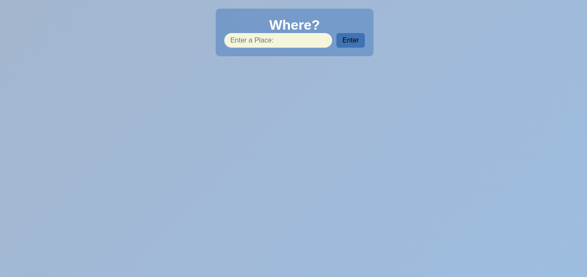
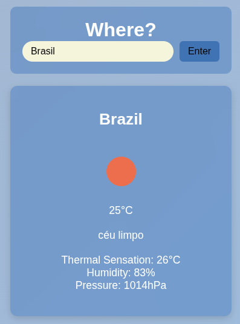
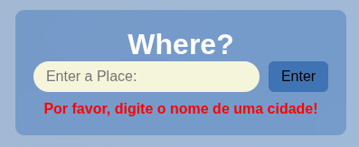

# 🌤️ Welcome to our Weather API Website Project!

This website was developed to provide users with real-time weather information using a modern and reliable weather API. The project aims to deliver a responsive, user-friendly, and visually appealing interface that displays current weather conditions for any location.

Built with modern web technologies, it follows best practices in performance, design, and usability. Whether you're exploring the project or contributing to its development — we're excited to have you here!

---

## Access
https://weather-one-iota-52.vercel.app/

--- 

### 🧠 Technologies Used

---

### 👨‍💻 How it Works?

#### 🟢 Step 1 – Initial UI

---

#### 🟡 Step 2 – Enter a Location

Just type in a city or place to get started.

---

#### 🔵 Step 3 – Weather Information

Displays:
- Location name
- Temperature
- Weather condition
- Feels like (thermal sensation)
- Humidity
- Pressure

---

#### 🔴 Step 4 – Error Handling

If the user submits an empty field or an invalid location, the app displays appropriate error messages.

---

